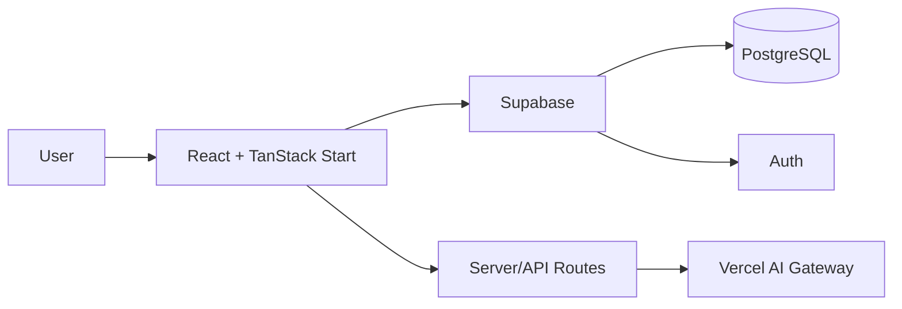

<div align="center">

# 🌾 AgroLink

### Smart farm data for producers. Transparent food data for consumers.

A full-stack platform that connects **farm intelligence**, **food traceability**, and an **AI support experience** in one application.


</div>

---

## 🌍 What AgroLink does

Agricultural technology is useful only when people can understand and trust the information around it.

AgroLink serves two audiences:

### For farmers

- field and sensor indicators;
- practical recommendations;
- educational content;
- pilot-farm updates and learning materials.

### For consumers

- product lookup by code;
- origin and production information;
- dates and available laboratory results;
- support chat for questions about products and food quality.

## ✨ Core features

- 🔐 Authentication backed by **Supabase**
- 🧑‍🌾 Dedicated farmer experience
- 🛒 Consumer product traceability flow
- 🤖 Streaming AI chat
- 🗃 Chat/history persistence
- ⚡ Server-side rendering and API routes with **TanStack Start**
- ☁️ Vercel-targeted production build
- 📱 Responsive UI

## 🧱 Architecture



## 🛠 Tech stack

| Area | Technology |
|---|---|
| UI | React 19, TypeScript |
| App framework | TanStack Start, TanStack Router |
| Styling | Tailwind CSS, Radix UI |
| Build tooling | Vite |
| Database & Auth | Supabase / PostgreSQL |
| AI | Vercel AI SDK + Vercel AI Gateway |
| Deployment | Vercel / Nitro |

## 🚀 Local development

### Requirements

- Node.js 22+
- npm

```bash
git clone https://github.com/xondell/farm-connect-main.git
cd farm-connect-main
cp .env.example .env
npm ci
npm run dev
```

Open the URL printed by Vite.

## 🔐 Environment variables

Create `.env` from `.env.example`.

| Variable | Purpose | Required |
|---|---|---|
| `VITE_SUPABASE_URL` | Browser Supabase client | Yes |
| `VITE_SUPABASE_PUBLISHABLE_KEY` | Browser Supabase client | Yes |
| `SUPABASE_URL` | SSR/server functions | Yes |
| `SUPABASE_PUBLISHABLE_KEY` | SSR/server functions | Yes |
| `AI_GATEWAY_API_KEY` | Local AI Gateway auth outside Vercel | No on Vercel |

> Variables beginning with `VITE_` are exposed to client-side JavaScript. Never place service-role keys or other secrets behind a `VITE_` prefix.

## ✅ Quality checks

```bash
npm run lint
npm run typecheck
npm run build
npm run check
```

The production build runs validation before creating the deployment artifact.

## 🗄 Supabase

Database migrations live in:

```text
supabase/migrations/
```

Apply the required migrations before enabling flows that depend on authentication or chat history.

For hosted deployments, remember to configure the production and preview domains in **Supabase Authentication → URL Configuration** so auth redirects resolve correctly.

## 📁 Project structure

```text
src/
├── routes/                 # Pages, protected routes and API endpoints
├── components/             # UI components
├── data/                   # Demo/storefront data
├── integrations/supabase/  # Supabase clients and auth middleware
├── lib/                    # Shared utilities
└── assets/                 # Bundled assets

supabase/
└── migrations/             # Database migrations

public/                     # Static assets
scripts/                    # Build/deployment helpers
```

## ☁️ Deployment

The repository targets Vercel.

1. Import the GitHub repository into Vercel.
2. Add Supabase environment variables for Preview and Production.
3. Create a Preview deployment.
4. Verify the main routes, authentication, product pages, and `/api/chat`.
5. Promote the tested deployment to Production.

For manual deployment:

```bash
npx vercel
npx vercel --prod
```

## 🔒 Production checklist

- Review Supabase RLS policies.
- Verify auth redirect URLs.
- Keep service-role credentials out of the client bundle.
- Add rate limiting/firewall protection to `POST /api/chat`.
- Test the Preview deployment before production promotion.

---

<div align="center">

**AgroLink — turning agricultural data into decisions and food data into trust.**

</div>
