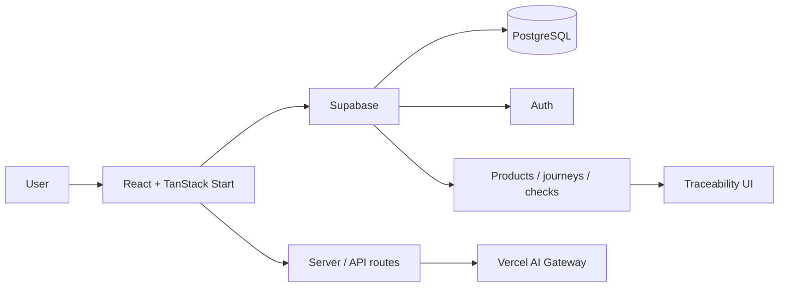

<div align="center">

# 🌾 AgroHelp

### Smart farm data for producers. Transparent food data for consumers.

A full-stack AgriTech platform that combines **farm intelligence**, **food traceability**, **product provenance**, **lab/inspection context**, and an **AI-assisted support experience**.

[**Live prototype**](https://farm-connect-main-ochre.vercel.app/) · [**AgroDev project**](https://github.com/xondell/agrodev-climate-champion)


</div>

---

## Why AgroHelp exists

Agricultural technology creates value only when the information behind it is understandable, actionable and trustworthy.

AgroHelp connects two sides of the same food system:

### 🧑‍🌾 For farmers
- field and production information;
- practical recommendations;
- production journal workflows;
- learning and pilot-farm content;
- support for turning raw data into decisions.

### 🛒 For consumers
- product lookup by traceability code;
- producer and origin information;
- production journey and dates;
- available inspection / lab context;
- farm location context on OpenStreetMap;
- product and food-quality support.

## What's new — August 2026

The repository has moved well beyond the original demo catalog:

- product pages were rebuilt around **Supabase-backed product data** with a local fallback;
- fake demo products were removed from the consumer experience in favor of traced products;
- product journeys and available lab checks are loaded with the product record;
- farm-location context was added with **OpenStreetMap**;
- the product name was standardized from **AgroLink → AgroHelp**;
- consumer discovery gained additional sorting controls;
- customer-facing currency display was switched from RUB to **GBP**.

## Core capabilities

- 🔐 Supabase-backed authentication
- 🧑‍🌾 Farmer-focused application flows
- 📓 Farmer production journal
- 🔎 Product traceability by product code
- 🧭 Origin / journey / farm-location context
- 🧪 Available inspection and lab-check data
- 🤖 Streaming AI chat through the Vercel AI stack
- 🗃 Persisted chat/history flows
- ⚡ Server rendering and API routes with TanStack Start
- 📱 Responsive interface
- ☁️ Vercel-targeted deployment

## Architecture



## Tech stack

| Area | Technology |
|---|---|
| UI | React 19.2, TypeScript |
| App framework | TanStack Start + TanStack Router |
| Styling | Tailwind CSS 4 + Radix UI |
| Data fetching | TanStack Query |
| Database & Auth | Supabase / PostgreSQL |
| AI | Vercel AI SDK + AI Gateway |
| Validation | Zod |
| Build tooling | Vite 8 |
| Deployment | Vercel / Nitro |

## Local development

### Requirements

- Node.js **22+**
- npm

```bash
git clone https://github.com/xondell/farm-connect-main.git
cd farm-connect-main
cp .env.example .env
npm ci
npm run dev
```

The development URL is printed by Vite.

## Environment variables

Create `.env` from `.env.example`.

| Variable | Purpose | Required |
|---|---|---|
| `VITE_SUPABASE_URL` | Browser Supabase client | Yes |
| `VITE_SUPABASE_PUBLISHABLE_KEY` | Browser Supabase client | Yes |
| `SUPABASE_URL` | SSR / server functions | Yes |
| `SUPABASE_PUBLISHABLE_KEY` | SSR / server functions | Yes |
| `AI_GATEWAY_API_KEY` | AI Gateway auth outside managed Vercel configuration | Environment-dependent |

> `VITE_*` values are exposed to client-side JavaScript. Never put service-role credentials or other secrets behind a `VITE_` prefix.

## Quality checks

```bash
npm run lint
npm run typecheck
npm run build
```

The `build` script already runs lint + type checking before the Vite build.

## Supabase

Versioned database changes live in:

```text
supabase/migrations/
```

Apply the required migrations before enabling flows that depend on authentication, persisted chat, product data, journeys or inspection information.

For hosted deployments, configure the production and preview domains in **Supabase Authentication → URL Configuration**.

## Repository map

```text
src/
├── routes/                 # Pages, protected routes and API endpoints
├── components/             # UI components
├── data/                   # Local fallback / presentation data
├── integrations/supabase/  # Supabase clients and auth integration
├── lib/                    # Shared utilities
└── assets/                 # Bundled assets

supabase/
└── migrations/             # Versioned database changes

public/                     # Static assets
scripts/                    # Build / deployment helpers
```

## Deployment

The project targets Vercel.

```bash
npx vercel
npx vercel --prod
```

Before promotion to production, verify:

- auth redirects;
- product-code routes;
- traced product data;
- map rendering;
- AI endpoint behavior;
- Supabase RLS;
- absence of server secrets from the client bundle.

---

<div align="center">

**AgroHelp — turning agricultural data into decisions and product data into trust.**

</div>
